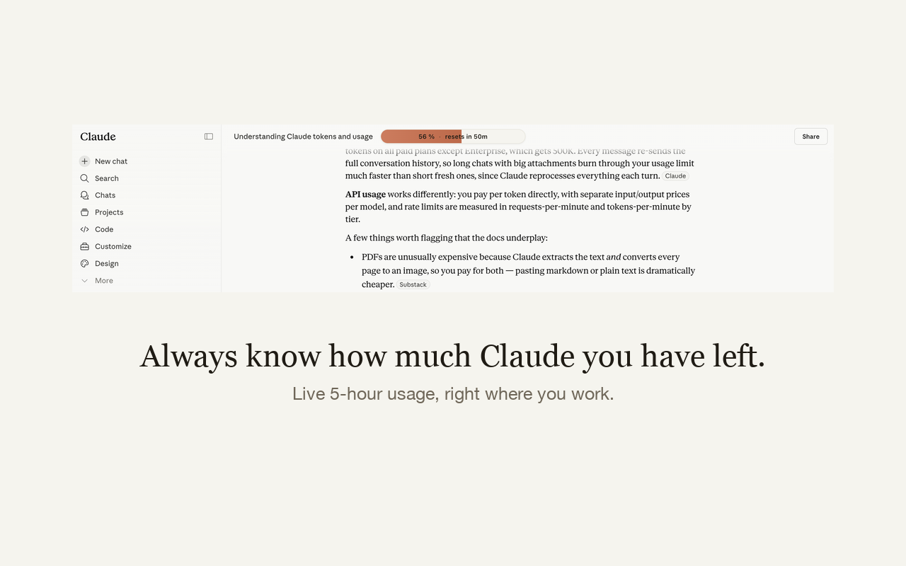
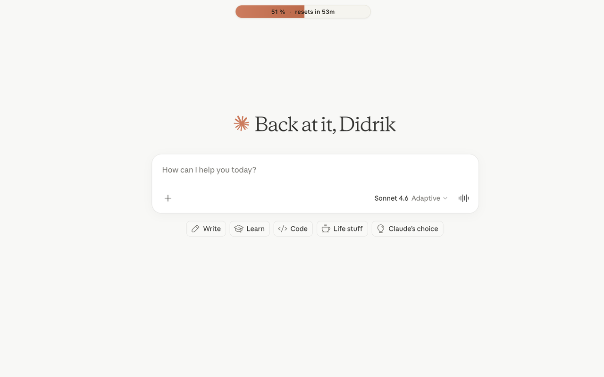

# Usage Bar for Claude

A tiny Chrome extension that puts your Claude.ai 5-hour usage right at the top of the page, so you always know how close you are to the limit without having to open the settings.

It is not made by Anthropic and is not affiliated with Anthropic in any way.




## What you get

A small pill at the top center of every Claude.ai page. It shows the same percentage you would see on the usage settings page, plus a live countdown to when your 5-hour window resets. The bar fills with Claude's coral color as you use up the window. When you hit 100 percent, it turns a deeper red so you can spot it at a glance.

## Install

Get it from the Chrome Web Store: [Usage Bar for Claude](https://chromewebstore.google.com/detail/imblbfhdbdecholhjbagcjahdkhidneb).

## Install from source

If you would rather load the extension manually, it only takes a minute.

1. Download or clone this repository to your computer.
2. Open Chrome and go to `chrome://extensions`.
3. Turn on "Developer mode" using the toggle in the top right.
4. Click "Load unpacked" and pick the folder you just downloaded.

That is it. Open Claude.ai (or refresh it if it was already open) and you should see the bar at the top.

## How it works

When you visit Claude.ai, the extension asks the same internal endpoint that the official usage page uses. It looks up your organization, then reads your current 5-hour utilization and the time it resets. It checks again every 30 seconds so the number stays fresh, and the countdown ticks every second on its own.

Everything runs inside your browser. There is no server, no analytics, no third party involved.

## Privacy

The extension only talks to Claude.ai itself, using your existing login. Your usage numbers never leave your computer. There is no tracking, no telemetry, no account creation, nothing to sign up for.

## Limitations

Things to know before you rely on this:

* It only shows the 5-hour bar. The 7-day numbers are not displayed.
* If you belong to more than one Claude organization, it picks the first one it finds.
* It uses an internal Claude.ai endpoint that is not officially documented. If Anthropic changes that endpoint, the bar will go blank until the extension is updated.
* It is not affiliated with or endorsed by Anthropic.

## Contributing

Pull requests are welcome. The code is small on purpose, four files plus a manifest. If you want to add the 7-day bar, an organization switcher, or a Firefox port, open an issue first so we can talk about it.

## Project layout

```
manifest.json         extension config
content.js            injects and updates the bar on claude.ai
background.js         handles the toolbar-icon toggle
styles.css            bar styling
icon{16,48,128}.png   toolbar and store icons
scripts/icon.py       one-shot script to regenerate the icons
privacy-policy.html   served via GitHub Pages, used in the store listing
```

## License

MIT. Do whatever you want with it, just do not blame the author if something breaks.
